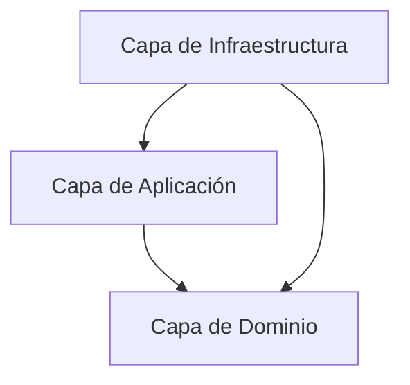

# Proyecto Alpha: Constitución de la Arquitectura de Software

## Resumen
Este proyecto sigue la **Arquitectura Limpia** (también conocida como Arquitectura Hexagonal o Puertos y Adaptadores). El objetivo principal es proteger la lógica de negocio (Dominio) de cambios en factores externos como frameworks, bases de datos o la interfaz de usuario.

## Capas de la Arquitectura

### 1. Capa de Dominio (El Corazón)
- **Ruta**: `src/domain`
- **Objetivo**: Representar la lógica y las reglas de negocio.
- **Restricciones**: 0 dependencias. Sin NestJS, sin Mongoose, sin librerías externas.
- **Contenido**:
  - `entities/`: Modelos de negocio puros.
  - `ports/`: Interfaces de Repositorios y Servicios.
  - `exceptions/`: Clases de error específicas del dominio.
- **Regla crítica**: Si un archivo en `src/domain` importa algo de `@nestjs/common`, el código es inválido.

### 2. Capa de Aplicación (Casos de Uso)
- **Ruta**: `src/application`
- **Objetivo**: Orquestar la lógica de negocio para lograr tareas específicas.
- **Restricciones**: Solo depende del Dominio.
- **Contenido**:
  - `use-cases/`: Clases de propósito único (ej. `CreateUserUseCase`).
  - `services/`: Lógica que abarca múltiples casos de uso.
  - `dtos/`: Estructuras de datos de entrada y salida.
- **Regla crítica**: 
  - Si un caso de uso en `src/application` accede a la base de datos directamente sin pasar por un puerto (interfaz), el código es inválido.
  - Cada nuevo caso de uso debe estar acompañado por su archivo de prueba unitaria `.spec.ts`.

### 3. Capa de Infraestructura (Detalles Técnicos)
- **Ruta**: `src/infrastructure`
- **Objetivo**: Implementar detalles técnicos y proporcionar puntos de entrada.
- **Restricciones**: Puede depender de cualquier capa.
- **Contenido**:
  - `controllers/`: Controladores de NestJS.
  - `persistence/`: Implementaciones de base de datos (Repositorios).
  - `adapters/`: Implementaciones de servicios externos (ej. Mailer).
  - `config/`: Configuración del entorno.

## Inyección de Dependencias
Utilizamos el sistema DI de NestJS. Las implementaciones de la capa de **Infraestructura** se inyectan en la capa de **Aplicación** a través de los **Puertos** definidos en la capa de **Dominio**.

## Fuente de Verdad
El contrato de la API se define en `docs/openapi.yaml`. Cualquier cambio en la API debe comenzar allí.
